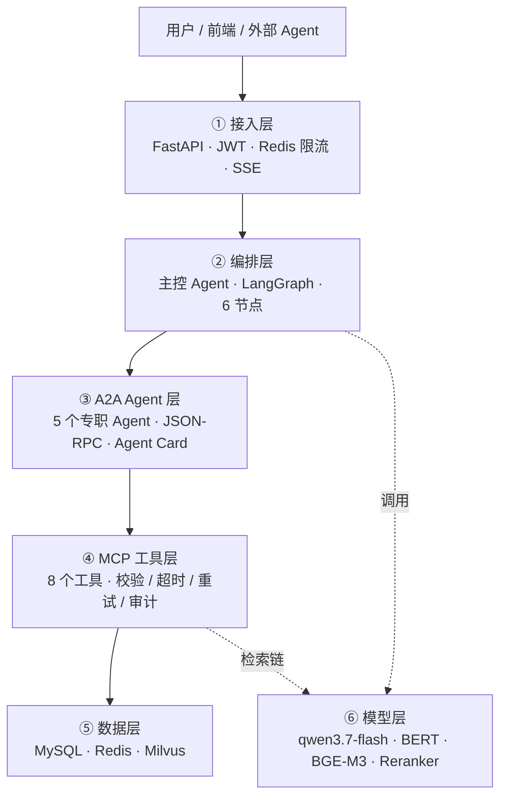
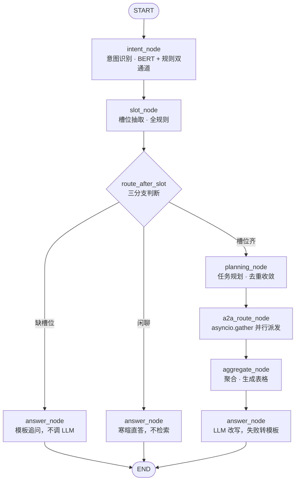
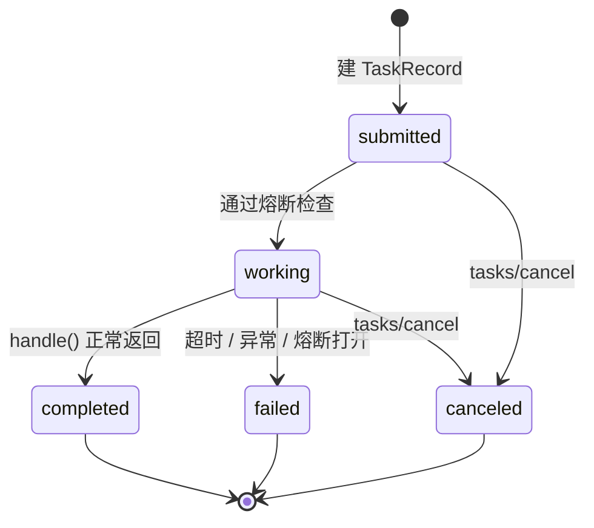
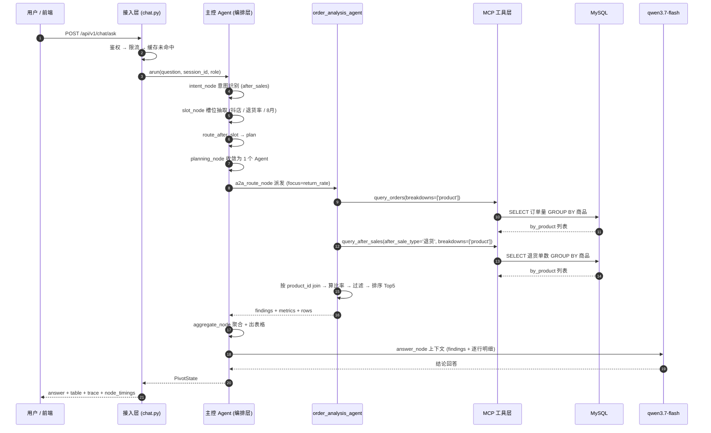

# 「商枢」CommercePivot 完整流程说明（技术版）

> 配套流程图：`docs/流程图_商枢全链路.html`（宽幅全链路，可截图进 PPT）
> 本文所有标识符均附中文注释，文末有**中英对照总表**（配置项 / 业务字段 / 接口与结构 / 数据表）。
> 所有链路描述与数字都来自真实代码与真实运行结果（`docs/evidence/`），无一处理论推测。

---

## 0. 一句话总览 + 阅读约定

**一句话**：用户用中文问一句经营问题，系统自己判断**想问什么**（意图）、**要哪些条件**（槽位）、**该派给谁**（规划），派给专职 Agent 并行取数，Agent 通过统一工具层查真实数据库，最后把结果算成结论加明细表返回。

本文用一个例子贯穿全篇：

> **「上个月抖店退货率最高的商品是什么？」**
> 实测结果：意图 `after_sales`（售后分析）置信度 0.8333，槽位 `platform=抖店 / metric=退货率 / 2026-08-01~2026-08-31`，
> 规划收敛为 1 个 Agent，A2A 调度段 168ms，最终回答「折叠晾衣架 33.33%（2 单退货 / 6 单成交）」，整条链路 3570ms。

**阅读约定**：形如 `intent_node`（意图识别节点）的写法，前半是代码里的真实标识符，括号里是中文含义。

### 术语先对齐：这里的「Agent」是什么

面试和评审最容易被卡住的一点。**Agent 不等于「大模型 + 工具清单」**，那只是 LLM Agent（ReAct / Function Calling）这一种范式。本项目用的是**编排式多智能体**：

| 维度 | 本项目的做法 |
|---|---|
| 谁决定流程 | **代码**。路由由 `route_after_slot`（槽位后条件边）与 `planning_node`（任务规划节点）的规则决定，不是模型决定 |
| 大模型出现在哪 | **只有一处**：`answer_node`（回答生成节点），把已经查到的结构化结果改写成通顺回答；闲聊路径同样只有一处 |
| Agent 是什么 | **有明确职责边界、有独立输入输出的处理单元**。用什么实现，取决于该环节对确定性 / 延迟 / 可审计的要求 |
| 工具调用契约 | 完整实现了标准 MCP（stdio / Streamable HTTP），能力上有；但合规场景要能回答「为什么走了这条路」，所以没让模型自己决定调哪个工具 |

> 一句话口径：**模型负责它擅长的语言理解与生成，流程决策交给编排层。**

---

## 1. 六层架构

```
用户 / 前端 / 外部 Agent
        │
        ▼
① 接入层    FastAPI · JWT 鉴权 · Redis 限流 · SSE 流式 · X-Request-ID 贯穿
        │
        ▼
② 编排层    主控 Agent（LangGraph 编排 6 个节点）
        │
        ▼
③ A2A 层    5 个专职 Agent（Agent Card 发现 · JSON-RPC 调用 · 超时熔断）
        │
        ▼
④ MCP 层    8 个工具（参数校验 · 超时重试 · 写门禁 · 审计双写）
        │
        ▼
⑤ 数据层    MySQL 业务与审计 · Redis 会话缓存限流 · Milvus 向量检索
        │
        ▼
⑥ 模型层    qwen3.7-flash 生成 · BERT 意图 · BGE-M3 向量 · Reranker 精排
```



**两条硬约束**（面试常问，值得记住）：

1. **Agent 不直连数据库。** 所有取数一律走 `call_tool`（调工具方法）→ `MCPClient`（MCP 客户端）→ `ToolRegistry`（工具注册表）。
   这样参数校验、权限门禁、审计、限流能集中在一层，Agent 无法绕过。
2. **口径留在 Agent，取数留给工具。** 工具层只返回原子数据（订单量、退货单数），
   业务口径（退货率 = 退货单数 ÷ 订单量）由 Agent 计算。口径要能改、要能解释，集中一处比散在多个 SQL 里好管。

---

## 2. 一次请求要过几道关

主链路共 **13 个环节**，按执行顺序排。表里每个英文标识符都附了中文含义。

### 第 1~5 关：接入层（`api/chat.py`）

| # | 环节 | 做了什么 | 为什么这么设计 |
|---|---|---|---|
| 1 | `RequestContextMiddleware`（请求上下文中间件） | 取请求头 `x-request-id`（请求追踪 ID）或新建 32 位十六进制 ID；调 `set_request_id()`（写入上下文）与 `begin_trace()`（开启链路追踪列表）；记录启动时间 | `X-Request-ID` 要贯穿全链路。注意 `begin_trace()` 必须在**进入口**就调用，靠共享引用跨节点累积，不开就没有可累积的对象 |
| 2 | `rate_limit_dependency`（限流依赖） | `RateLimiter.check()`（限流器检查）按 `IP + 接口路径` 做 Redis 固定窗口计数，键为 `rate_limit:{ip}:{path}:{window}`；超限返回 429 | Redis 不可用时 **fail-open**（放行）——限流是保护措施，不该反过来把服务打死 |
| 3 | `principal_from_request()`（解析调用者身份） | 解析 `Authorization: Bearer`，`decode_token()`（校验令牌）验 HS256 签名与 `exp`（过期时间），得到 `Principal`（调用者身份对象，含 `subject` 主体 / `role` 角色） | 角色三分：`admin` 全权 / `operator` 可读可有限写 / `customer` 仅读 |
| 4 | 问答缓存 | 先跑一次轻量 `classify_intent()`（意图分类）拿 `primary`（主意图）当 `skill`（技能维度），拼缓存键 `cache:ask:{skill}:{role}:{hash}`（hash = `question` 的 sha256 前 32 位） | 缓存键带 `skill` 维度是文档 §6 的规定。意图分类规则分支耗时在微秒级，命中即返回，**避免整条 A2A 链路空跑** |
| 5 | `orchestrator.arun()`（编排器执行） | `initial_state()`（构造初始状态）生成 `PivotState`（编排共享状态）→ `ensure_trace()`（兜底确保有 trace）→ 走 `ainvoke()`（一次性执行）或 `astream()`（流式执行） | 编排器启动时探测 LangGraph 是否可用，不可用则退化为同一组节点的**顺序执行**，对外行为一致 |

> **为什么先分类一次再进编排？** 缓存键需要 `skill`，而 `skill` 来自意图识别。
> 重跑一次分类的成本远低于把整条 A2A + MCP 链路跑完再发现可以命中缓存。

### 第 6~10 关：编排层（`orchestrator/`）

| # | 节点 | 做了什么 | 输出到状态 |
|---|---|---|---|
| 6 | `intent_node`（意图识别节点） | `classify_intent(question)` → `IntentResult`（意图结果）。**双通道**：BERT 模型出分 + 关键词/正则规则，取更可信的一方，`source`（来源字段）如实标注 `bert` / `rule` / `hybrid` | `intent`（意图对象）、`skill`（技能维度） |
| 7 | `slot_node`（槽位抽取节点） | `extract_slots()`（抽取槽位）→ `SlotResult`（槽位结果）。平台走 `PLATFORM_ALIASES`（平台别名表）、广告渠道走 `AD_PLATFORM_ALIASES`（广告渠道别名表）、指标走 `METRIC_ALIASES`（指标别名表）；时间走 `parse_period()`（时间解析） | `slots`（槽位）、`missing_slots`（缺失槽位）、`clarification`（追问话术）、`defaults_applied`（套用的默认值） |
| 8 | `route_after_slot`（槽位后条件边） | 三分支判断：闲聊 → `chitchat`（寒暄直答）；有缺失槽位 → `clarify`（追问）；否则 `plan`（进入规划） | 决定走哪条边 |
| 9 | `planning_node`（任务规划节点） | 按 `intent.matched`（命中的意图列表）查 `INTENT_TAXONOMY`（意图分类字典）拿 `agent`（智能体名）；`_focus_for()`（定焦点）决定取数口径；再跑三条收敛规则 | `plan`（任务计划数组）、`plan_reason`（规划说明） |
| 10 | `a2a_route_node`（A2A 派发节点） | `get_agent_registry().dispatch_many()`（批量派发）用 `asyncio.gather`（并发聚合）同时唤起多个 Agent；每个任务单独包异常 | `agent_tasks`（任务记录列表）、`errors`（错误列表） |

**关于第 7 关的两个重点**（反直觉，最值得记）：

- **`slot_node` 刻意不调大模型。** 槽位的值域是**封闭的**（平台就那么几个、指标就十来个），
  规则比模型更准、可回归测试、零 token 成本。用大模型做这件事，是花大钱买更差的结果。
- **只有「缺了会导致答案错误」的槽位才追问。** 「缺了只是不够精确」的一律套默认值并在答案里注明。
  比如问「上个月销售趋势怎么样」没给指标，就默认按销售额算并标注口径，而不是弹一句反问。
  追问由 `_evaluate_missing()`（缺失判定）控制，判据是 `REQUIRED_SLOTS`（必需槽位表）加上排行类问句的隐含必需项。

**关于第 9 关的三条收敛规则**（这就是「规划」的价值——**去重而不是叠加**）：

| 规则 | 触发的问句形态 | 做法 |
|---|---|---|
| 规则 2 | 分析类问题同时问到规则/政策（含「规定 / 规则 / 能不能 / 条件」） | 并行拉一次知识库，`role`（角色）标 `support`（支撑） |
| 规则 2.5 | 主意图是知识问答**且**不含明确取数诉求（`_asks_for_data()` 判定） | 只留 `knowledge_rag_agent`（知识问答智能体）。因为「七天无理由退货的条件是什么」会让意图引擎顺带命中 `after_sales`（出现了「退货」二字），但用户要的是**解释**不是**退货数据** |
| 规则 3 | 问题命中退货率 / 退款率 | 收敛为 `order_analysis_agent`（订单分析智能体）+ `focus=return_rate`（焦点=退货率）。退货率是「订单量 × 退货单数」的**联合口径**，唯一执行者就是订单 Agent，`after_sales_agent` 必须移出计划，否则同一口径被算两遍 |

> **踩过的坑**：`plan_reason`（规划说明）早期用「Agent 名 → 意图名」**反查** `INTENT_TAXONOMY`。
> 但 `sales` / `order` / `ad` **三个意图都映射到同一个** `order_analysis_agent`，
> 反查会按字典序命中排最前的 `sales`；而退货率排行这个计划项里 `intent` 是 `after_sales`、
> `agent` 被规划规则收敛成 `order_analysis_agent`，于是「售后分析」被显示成「销售分析」。
> 现在直接用计划项里**已经确定的** `item["intent"]` 取名，不再反查。

### 第 11~13 关：Agent 与工具层

| # | 环节 | 做了什么 | 关键设计 |
|---|---|---|---|
| 11 | `BaseAgent.run()`（Agent 执行入口） | 建 `TaskRecord`（任务记录），状态机 `submitted → working → completed/failed/canceled`；`CircuitBreaker.before_call()`（熔断器前置检查）；`asyncio.wait_for(self.handle(input), timeout)`（带超时执行）；落库 `agent_tasks` 表 | 连续失败 3 次打开熔断，30s 后转 `half-open`（半开）试探 |
| 12 | `call_tool()`（调工具）→ `MCPClient.call()`（MCP 客户端调用） | 传输 `MCP_TRANSPORT=local`（进程内直调注册表）或 `http`（POST 到独立 MCP Server :8001） | 两种传输返回体结构一致，Agent 无需关心差异；HTTP 传输失败会自动回退进程内调用 |
| 13 | `ToolRegistry.call()`（工具注册表调用） | ① 写门禁 `ensure_write_allowed()`（校验写权限）② 参数校验 `model_validate()`（Pydantic 校验，`extra="forbid"` 禁止未声明参数）③ `_invoke()` 走 `asyncio.to_thread`（扔到线程池，不阻塞事件循环）+ `asyncio.wait_for()` 超时 ④失败重试 1 次 ⑤审计 `write_audit()`（JSONL + MySQL `mcp_audit` 表） | **`call()` 不抛异常**，而是返回结构化结果 `{"ok": false, "code": ..., "message": ...}`，让上游 Agent 拿到可读原因决定是否降级 |

---

## 3. 编排层流程图

主控 Agent 的六个节点与那个三分支判断（对应上面的第 6~10 关）：



**为什么闲聊要单独短路？** 闲聊在 `INTENT_TAXONOMY` 里没有对应 Agent，
若照常进入规划，会被兜底规则「未匹配到专属 Agent → 退回知识库问答」捞走——
于是一句「你好」也要跑一次向量检索（实测约 2.6 秒），返回的还是三条不相干的退货政策。
现在闲聊在 `route_after_slot` 就短路到 `answer_node`，**不规划、不调 Agent、不检索**。

注意 `_is_smalltalk()`（是否纯闲聊）的判据：主意图是闲聊**且**没有任何业务 Agent 被命中。
所以「你好，帮我看下上个月销售额」这类带业务诉求的问候**不会被短路**（意图判为 `sales`，正常调度）。

### A2A 任务状态机



`tasks/send`（提交任务）、`tasks/get`（查询状态）、`tasks/cancel`（取消任务）三个 JSON-RPC 方法，
以及 `agent/card`（取 Agent 描述卡）。

---

## 4. A2A Agent 层

5 个专职 Agent，加 1 个主控共 6 个。**注意区分**：`orchestrator/` 里的 `intent_node` / `slot_node` 等是**节点不是 Agent**。

| Agent | 端口 | 职责 | 用到的工具 | 技能（`skills`） |
|---|---|---|---|---|
| `order_analysis_agent` | 8002 | 订单与退货分析 | `query_orders` / `query_after_sales` / `query_ad_reports` | 销售统计、退货率排行、趋势 |
| `product_analysis_agent` | 8003 | 商品与库存 | `query_products` / `query_inventory` | 商品表现、库存预警 |
| `after_sales_agent` | 8004 | 售后客服 | `query_after_sales` / `search_knowledge` / `create_ticket` | 售后原因分布、工单 |
| `knowledge_rag_agent` | 8005 | 知识问答 | `search_knowledge` | 政策 / FAQ 检索并带来源 |
| `report_agent` | 8006 | 报表导出 | `generate_report` | 按关键词选报表类型 |

**`AgentCard`（Agent 描述卡）** 是发现契约，字段：`name` 名称 / `description` 描述 / `version` 版本 /
`skills` 技能列表 / `endpoint` 调用地址 / `input_schema` 入参结构 / `output_schema` 出参结构 /
`tools` 依赖工具 / `capabilities` 能力声明 / `provider` 提供方。
对外暴露在 `/.well-known/agent-card.json`（主控卡）与 `/.well-known/agents`（全部专职 Agent）。
卡片会写 Redis 缓存（键 `agent_card:{name}`，TTL 300 秒），避免每次发现都重建 schema。

**输出契约**（`_normalize()` 统一补齐，Agent 不用手写全字段）：
`data`（结构化数据，含 `rows` 明细与 `summary` 汇总）/ `findings`（结论要点）/ `metrics`（核心指标）/
`citations`（知识来源）/ `notes`（执行备注）/ `degraded`（是否降级）+ `degrade_reason`（降级原因）。

---

## 5. MCP 工具层

8 个工具，每个都在 `ToolRegistry`（工具注册表）里声明了名称、描述、Pydantic 参数模型、超时、是否只读。

| 工具 | 类型 | 说明 |
|---|---|---|
| `query_orders` | 读 | 订单聚合；`breakdowns`（聚合切片）支持 `product` / `platform` / `status` / `date` / `region` / `category` 多维切片 |
| `query_products` | 读 | 商品与 SKU 明细 |
| `query_after_sales` | 读 | 售后 / 退货记录聚合 |
| `query_inventory` | 读 | 库存与低库存预警 |
| `query_ad_reports` | 读 | 广告投放（消耗 / 成交 / ROI） |
| `search_knowledge` | 读 | 知识检索：BGE-M3 → Milvus 混合 → Reranker，逐级降级 |
| `generate_report` | 写（文件） | 9 种报表导出 CSV / JSON |
| `create_ticket` | 写 | 建工单，受 `ENABLE_WRITE_OPS`（写操作开关）门禁 |

> `breakdowns` 用**列表参数**而不是一堆布尔开关：好处是切片维度可组合、参数面收敛、Schema 自解释。

**三种接入方式**：

| 传输 | 地址 / 启动 | 协议 | 鉴权 | 适用 |
|---|---|---|---|---|
| `stdio`（标准输入输出管道） | `python -m commercepivot.mcp_server.stdio_server` | 标准 MCP | 无（宿主进程内） | Claude Desktop / Cursor 等桌面宿主 |
| `Streamable HTTP` | `POST http://127.0.0.1:8001/mcp` | 标准 MCP | 无（仅本机） | 进程外 / 远程 MCP 客户端 |
| REST | `POST /api/v1/mcp/tools/call` | 自定义（原生 + JSON-RPC 双风格） | JWT + 限流 | 自研前端、curl、第三方集成 |

---

## 6. RAG 检索链路

一次知识检索的完整链路：

```
问句 → BGE-M3 稠密 + 稀疏编码 → Milvus 混合召回（RRF 融合）recall_k 条
     → BGE-Reranker 精排 → 取 top_k 条
     任一环节不可用 → 自动降级为 MySQL FULLTEXT（ngram 全文索引）/ LIKE
```

标识符对照：
- `search_knowledge()`（检索入口）在 `retrieval/service.py`
- `stages`（阶段快照）把「召回数量 `recall_count`、召回模式 `recall_mode`、重排器 `reranker`、耗时」暴露给上层
- `encode_query()`（编码查询）返回 `(dense, sparse)` 稠密与稀疏两个向量
- `_vector_recall()`（向量召回）多集合检索后按 `score`（相似度分）合并
- `rerank()`（精排）+ `reranker_status()`（重排器状态）
- 召回模式 `retrieval_mode` 取值形如 `milvus-hybrid`（Milvus 混合）/ `milvus-dense`（纯稠密）/ `mysql-fulltext`（全文降级）/ `mysql-like`（LIKE 降级）

`knowledge_rag_agent`（知识问答 Agent）把命中结果转成 `citations`（引用列表），
每条带 `id` / `title` 标题 / `source` 来源 / `collection` 集合 / `score` 相关度 / `retrieval_mode` 检索模式。
回答里可以标注「依据：xxx」，避免模型凭空编造。

---

## 7. 数据层与缓存设计

### MySQL（12 张表）

`products`（商品）· `orders`（订单）· `order_items`（订单明细）· `after_sales`（售后单）·
`inventory`（库存）· `ad_reports`（广告日报）· `chat_sessions`（会话）· `chat_messages`（消息）·
`mcp_audit`（MCP 调用审计）· `agent_tasks`（Agent 任务）等。

### Redis 键设计

| 键 | 用途 | 说明 |
|---|---|---|
| `cache:ask:{skill}:{role}:{hash}` | 问答缓存 | 带 `skill` 与 `role` 双维度，避免不同角色拿到同一份答案 |
| `session:{session_id}` | 会话上下文 | 多轮追问用 |
| `rate_limit:{ip}:{path}:{window}` | 限流计数 | 固定窗口 |
| `agent_card:{name}` | Agent 卡缓存 | TTL 300 秒 |

### Milvus 集合

`product_kb`（商品知识）16 条 · `faq_kb`（客服 FAQ 与平台规则）24 条，
字段为 `id` / `text` 正文 / `dense_vector` 稠密向量 / `sparse_vector` 稀疏向量 / `metadata` 元数据。

---

## 8. 降级矩阵（本项目最核心的工程价值）

**原则：没有密钥、没有模型、没有中间件，系统照样能给出基于真实数据的答案；且降级必须显式可见。**

| 能力 | 首选 | 缺失时降级 | 行为 |
|---|---|---|---|
| 意图识别 | BERT（`INTENT_BERT_PATH` 模型路径） | 规则引擎（关键词 + 正则消歧） | `source` 字段标 `rule`，多意图仍可识别 |
| 向量化 | BGE-M3（稠密 + 稀疏） | 哈希向量器（blake2b 词袋，维度 1024） | 检索质量下降但可用 |
| 重排 | BGE-Reranker 交叉编码器 | 词法重排（字符 bigram 覆盖 + 词交集） | 排序仍有区分度 |
| 向量库 | Milvus | MySQL FULLTEXT（ngram）→ LIKE | `stages` 字段标注实际链路 |
| 数据查询 | MySQL | **不降级** | MySQL 不可用直接报错，**绝不用假数据** |
| 生成模型 | 百炼 qwen | 模板回答（真实数据拼装） | `answer_source=template` |
| 缓存 / 会话 | Redis | 进程内 KV | 单实例可用 |
| 编排 | LangGraph | 顺序执行同一组节点 | `orchestrator_mode=sequential` |
| 写操作 | 门禁开启 | 默认关闭 | 返回结构化拒绝，不报异常 |

每次响应都带 `degraded`（是否降级）与 `degrade_reasons`（降级原因列表），
`/health` 接口能逐组件看到原因，方便排查，而不是「悄悄变成错答案」。

**两个易混字段**（面试常被追问）：

- `answer_source`（回答来源）表示**走了哪条链路**：`llm` / `template` / `clarification`（追问）/ `chitchat`（闲聊）
- `answer_meta.generator`（生成者）表示**这段文字是谁写的**：`llm` / `template`

闲聊就是这样：链路恒为 `chitchat`（自检据此断言「绝不检索知识库」），
而生成者随 `API_KEY`（模型密钥）可用与否在 `llm` / `template` 之间切换。

---

## 9. 可观测性

| 手段 | 实现 |
|---|---|
| 请求追踪 | `X-Request-ID` 贯穿全链路，响应头回写；日志与审计统一带 `request_id` |
| 链路 trace | `trace_add()`（追加追踪记录）按 `route → a2a → mcp → llm` 累积，`include_trace=true` 时随响应返回 |
| 审计 | `write_audit()`（写审计）双写 JSONL 文件 + MySQL `mcp_audit` 表，含工具名、参数摘要、耗时、成败，参数脱敏 |
| 指标 | Prometheus 文本格式，`/metrics` 暴露；标签按**路由模板**打标（避免高基数） |
| 自检 | `smoke`（端到端自检）逐项给 `PASS` / `DEGRADED`（降级）/ `FAIL` |

> **trace 为什么用「可变列表 + 原地 append」而不是「不可变元组 + `set()`」**：
> 编排跑在 LangGraph 上，每个节点都在**独立的子上下文**里执行（子 Agent 调工具还过一层 `asyncio.to_thread`）。
> `ContextVar.set()`（上下文变量赋值）只改当前上下文里的绑定，子上下文换出去的新对象不会回传给父上下文——
> 实测用元组实现时，最终只剩 `answer_node` 自己写的两条，前面 5 个节点的 `route` / `a2a` / `mcp` 记录全丢。
> 改成「入口创建一个列表、就地 `append()`」后，父子上下文持有的是**同一个列表引用**，
> 任何深度的子上下文追加都能被最外层读到（实测 2 条 → 15 条）。

---

## 10. 完整案例：逐步走一遍

**输入**（`AskRequest` 请求体）：

```json
{
  "question": "上个月抖店退货率最高的商品是什么",
  "session_id": "sess-evidence",
  "include_trace": true,
  "use_cache": false
}
```

| 环节 | 真实输出 |
|---|---|
| ① 接入层 | 鉴权通过（`role=operator`）、限流放行、缓存未命中（`use_cache=false` 主动关闭） |
| ② `intent_node` | `primary=after_sales`（售后分析），`domain=经营分析`，`confidence=0.8333`，`source=rule`。命中词可查：`退货率`、`退货`、正则 `退(货\|款).*(最多\|最高\|排名\|top)`；`matched=["after_sales","product"]` |
| ③ `slot_node` | `platform=抖店`、`metric=退货率`、`order=desc`、`after_sale_type=退货`、`start_date=2026-08-01`、`end_date=2026-08-31`、`period_label=2026年8月`、`top_k=5`。`missing_slots=[]`、`defaults_applied=[]`（什么都没缺，也没套默认值） |
| ④ `route_after_slot` | 走 `plan`（不是闲聊、不缺槽位） |
| ⑤ `planning_node` | 意图层命中了 `after_sales` + `product` 两个 Agent，规划层按**规则 3** 收敛为 1 个：`[{agent: order_analysis_agent, intent: after_sales, focus: return_rate, role: primary}]`。`plan_reason`：「售后分析 → order_analysis_agent；命中退货率排行口径 → 收敛为 `order_analysis_agent(focus=return_rate)`，避免仅因问句出现「商品」二字就并行调用无关 Agent 污染结论」 |
| ⑥ `a2a_route_node` | 派发 1 个任务，`status=completed`，`elapsed_ms=165`（整段 `a2a_route_node` 计时 168ms） |
| ⑦ Agent 内两步取数 | 第 1 步 `query_orders(breakdowns=["product"])` 拿每个商品的**订单量**；第 2 步 `query_after_sales(after_sale_type="退货", breakdowns=["product"])` 拿每个商品的**退货单数** |
| ⑧ Agent 内 join | 按 `product_id` 分别累加（**必须累加不能覆盖**——同款商品在不同平台各占一行，直接覆盖会丢量，早期版本表现为「全平台退货率 0%」），算 `return_rate = return_count × 100 / order_count`，过滤成交 < 5 单的样本，按退货率降序取 Top5 |
| ⑨ `aggregate_node` | 按 `AGENT_PRIORITY`（Agent 展示优先级）排序；`metrics` 加前缀（`order_overall_return_rate=3.66` / `order_order_count=382` / `order_top_product=折叠晾衣架`）；`_build_table()` 用 `TABLE_COLUMNS`（表格列偏好）与 `COLUMN_LABELS`（列名中文映射）出 5 行 × 7 列表格 |
| ⑩ `answer_node` | `_context_for_llm()`（拼 LLM 上下文）把 `findings` 与表格逐行明细（`_render_table_for_llm()`，上限 `MAX_CONTEXT_ROWS=30`）一起喂给模型；`llm.chat()` 用 `ANSWER_SYSTEM_PROMPT`（回答生成提示词），`max_tokens=800`，`answer_source=llm` |
| ⑪ 回写 | `_persist_turn()`（会话落库）写 MySQL `chat_messages` + Redis 会话；非降级才写 `cache_set()`（写缓存）。响应带 `node_timings`（各节点耗时）与 `trace`（链路追踪 15 条） |

**节点耗时**（真实）：

| 节点 | 耗时 |
|---|---|
| `intent_node` | 0ms |
| `slot_node` | 2ms |
| `planning_node` | 0ms |
| `a2a_route_node` | 168ms |
| `aggregate_node` | 0ms |
| `answer_node` | **3378ms** |
| **整条链路** | **3570ms** |

> 结论很清楚：**前 5 个节点加起来 2ms，时间几乎全花在大模型生成上**。
> 所以后来关掉了混合推理模型默认输出的思维链，回答阶段耗时下降约 58%、生成 token 下降约 64%。

**最终回答**（`answer_source=llm`，真实输出）：

```
上个月抖店退货率最高的商品是「折叠晾衣架」，其退货率为 33.33%。

2026年8月抖店整体退货率为 3.66%。按退货率降序排列，前5名商品明细如下：
1. 折叠晾衣架（家居），订单量6，退货单数2，退货率 33.33%，退款金额 ¥311.21；
2. 阳澄湖大闸蟹礼券（食品），订单量8，退货单数2，退货率 25.00%，退款金额 ¥2,734.86；
3. 纯棉基础T恤（服饰），订单量7，退货单数1，退货率 14.29%，退款金额 ¥78.09；
4. 智能马桶盖（家电），订单量7，退货单数1，退货率 14.29%，退款金额 ¥837.26；
5. 低糖燕麦饼干（食品），订单量8，退货单数1，退货率 12.50%，退款金额 ¥35.66。

这5个商品的退货率均显著高于整体均值（≥1.5倍），建议优先排查质量或描述不符问题。
```

**返回的表格**（`table.kind=return_rate`，5 行 × 7 列）：

| 商品 | 类目 | 平台 | 订单量 | 退货单数 | 退货率(%) | 退款金额 |
|---|---|---|---|---|---|---|
| 折叠晾衣架 | 家居 | 抖店 | 6 | 2 | 33.33 | ¥311.21 |
| 阳澄湖大闸蟹礼券 | 食品 | 抖店 | 8 | 2 | 25.0 | ¥2,734.86 |
| 纯棉基础T恤 | 服饰 | 抖店 | 7 | 1 | 14.29 | ¥78.09 |
| 智能马桶盖 | 家电 | 抖店 | 7 | 1 | 14.29 | ¥837.26 |
| 低糖燕麦饼干 | 食品 | 抖店 | 8 | 1 | 12.5 | ¥35.66 |

### 这条链路的时序图



### 另外三条分支（同一个系统，不同问法）

| 问句 | 走的链路 | 实测结果 |
|---|---|---|
| 「上个月各平台的销售额分别是多少？」 | 槽位自动带上 `breakdowns=["platform"]`，表格给平台切片 | 2698ms，表格 5 行（平台 / 订单量 / GMV / 买家数），合计 GMV ¥437,698.77 |
| 「七天无理由退货的条件是什么」 | 意图 `knowledge_qa`，规则 2.5 只留知识库 | 检索模式 `milvus-hybrid`，Top-1 相关度 0.7391，命中 3 条并带来源引用 |
| 「你好」 | `route_after_slot` 直接短路 | `plan=[]`、`agent_tasks=[]`、`citations=0`、`table=null`，**不产生任何工具与 Agent 调用** |

---

## 11. 与生产形态的差距（如实说明）

以下都是**开发形态 vs 生产形态**的连接方式差异，**协议与契约不变，只换连接方式**，上层代码不用改：

| 开发形态（本项目） | 生产形态（上线时） |
|---|---|
| MCP `stdio`（本机进程间管道） | MCP over Streamable HTTP（远程传输），契约一致 |
| 嵌入式向量库（随进程启动的本地文件） | 向量库集群 + 元数据存储 + 对象存储 |
| 本地 CPU 推理（BERT / BGE） | GPU 推理服务化（Triton / vLLM）+ 动态批处理 |
| 进程内直调（`MCP_TRANSPORT=local`） | 远程服务调用 + 服务发现 + 超时熔断，契约一致 |
| 本地文件审计（JSONL） | 审计中心 + 日志平台 + 链路追踪 |
| 本地评估脚本（`smoke` 自检） | CI 流水线评估门禁 |
| 单密钥直连模型厂商 | 统一 LLM 网关（限流 / 配额 / 多供应商路由） |
| 业务数据为构造的样本集 | 接客户授权的真实业务库，适配器换一层，编排层不动 |

> **不编造生产环境的绝对性能数字。** 本文所有耗时都是单节点实测值，
> 瓶颈清楚落在精排与向量编码上；线上按无状态服务 + 多实例部署扩容。

---

## 附录 A：中英对照总表

### A.1 配置项（`core/config.py` 单一 `Settings` 实例）

| 配置项 | 中文含义 | 默认 / 取值 |
|---|---|---|
| `API_KEY` | 大模型 API 密钥 | 占位符，真实值只放控制台环境变量 |
| `LLM_BASE_URL` | 大模型接口地址 | 百炼兼容端点 |
| `LLM_MODEL` | 生成模型名 | `qwen3.7-flash` |
| `LLM_ENABLE_THINKING` | 是否开启思维链 | `false`（混合推理模型默认吐思维链，纯属浪费 token） |
| `LLM_TEMPERATURE` | 采样温度 | 低温度，保证事实性 |
| `LLM_TIMEOUT_S` | 大模型超时 | 秒 |
| `MYSQL_HOST/PORT/USER/PASSWORD/DB` | MySQL 连接参数 | — |
| `MYSQL_POOL_SIZE` | 连接池大小 | 轻量 LifoQueue 池 + ping 保活 |
| `REDIS_HOST/PORT/PASSWORD/DB` | Redis 连接参数 | — |
| `MILVUS_URI` | 向量库地址 | 本地文件路径或远端地址 |
| `MILVUS_COLLECTION_PRODUCT` / `_FAQ` | 两个集合名 | `product_kb` / `faq_kb` |
| `MILVUS_DENSE_DIM` | 稠密向量维度 | 1024 |
| `RETRIEVAL_TOP_K` | 召回条数 | 召回阶段取多少 |
| `RERANK_TOP_K` | 精排后保留条数 | 最终给模型几条 |
| `INTENT_BERT_PATH` | 意图模型路径 | 留空即降级为规则引擎 |
| `BGE_M3_PATH` | 向量模型路径 | 留空即降级为哈希向量器 |
| `RERANKER_PATH` | 精排模型路径 | 留空即降级为词法重排 |
| `MCP_TRANSPORT` | MCP 传输方式 | `local`（进程内直调）/ `http`（走独立 MCP Server） |
| `MCP_TOOL_TIMEOUT_S` | 工具超时 | 秒 |
| `MCP_TOOL_RETRIES` | 工具重试次数 | 默认 1 次 |
| `A2A_TIMEOUT_S` | Agent 任务超时 | 秒，超时返回部分结果 |
| `A2A_CIRCUIT_FAIL_THRESHOLD` | 熔断失败阈值 | 默认 3 次 |
| `A2A_CIRCUIT_RESET_S` | 熔断冷却时长 | 默认 30 秒后半开 |
| `CACHE_TTL_S` | 问答缓存 TTL | 秒 |
| `JWT_SECRET` | 令牌签名密钥 | 脱敏输出 |
| `JWT_EXPIRE_MINUTES` | 令牌有效期 | 分钟 |
| `RATE_LIMIT_PER_MINUTE` | 每分钟限流额度 | 按 IP + 路径 |
| `RATE_LIMIT_ENABLED` | 是否启用限流 | 关闭即不限流 |
| `ENABLE_WRITE_OPS` | 写操作总开关 | 默认 `false`，只读优先 |
| `LOG_LEVEL` / `LOG_JSON` | 日志级别 / 是否 JSON | stdio 模式下日志改走 stderr |
| `AUDIT_LOG_PATH` | 审计文件路径 | JSONL |

### A.2 业务字段（槽位与状态）

| 字段 | 中文含义 | 示例 |
|---|---|---|
| `question` | 用户原始问题 | 上个月抖店退货率最高的商品是什么 |
| `session_id` | 会话 ID | `sess-...` |
| `user_id` | 用户 ID | 用于会话归属 |
| `role` | 角色 | `admin` / `operator` / `customer` |
| `top_k` | 返回条数 | 5 |
| `skill` | 技能维度（缓存键用） | 取主意图 |
| `request_id` | 请求追踪 ID | 32 位十六进制 |
| `intent` | 意图对象 | `primary` 主意图 / `confidence` 置信度 / `source` 来源 / `hits` 命中词 / `matched` 命中列表 |
| `slots` | 抽出来的槽位 | 见下 |
| `slot.platform` | 平台 | 抖店 |
| `slot.ad_platform` | 广告投放渠道 | 巨量引擎 / 京东京准 |
| `slot.metric` | 指标 | 退货率 / 销售额 / 订单量 / 客单价 |
| `slot.start_date` / `end_date` | 时间范围 | 2026-08-01 / 2026-08-31 |
| `slot.period_label` | 时间口径标签 | 2026年8月 |
| `slot.order` | 排序方向 | `desc` 降序 / `asc` 升序 |
| `slot.breakdowns` | 聚合切片维度 | `["platform"]` |
| `slot.group_by` | 分组粒度 | `day` / `week` / `month` / `category` / `region` |
| `slot.min_orders` | 样本量下限 | 默认 5 单 |
| `slot.want_trend` | 是否要趋势 | 布尔 |
| `slot.status` | 订单 / 售后状态 | 已完成 / 待审核 |
| `slot.after_sale_type` | 售后类型 | 退货 / 换货 / 仅退款 |
| `missing_slots` | 缺失的必需槽位 | 为空表示不用追问 |
| `clarification` | 追问话术 | 缺指标时的反问句 |
| `defaults_applied` | 套用的默认值说明 | 「未指定时间范围，默认统计近 30 天」 |
| `plan` | 任务计划 | `[{agent, intent, focus, role}]` |
| `plan_reason` | 规划说明 | 为什么这么派活 |
| `focus` | 取数焦点 | `return_rate` / `orders` / `ad` / `knowledge` |
| `role`（计划项内） | 任务角色 | `primary` 主 / `secondary` 次 / `support` 支撑 |
| `agent_tasks` | Agent 任务记录 | `{id, agent_name, status, elapsed_ms, error}` |
| `findings` | 各 Agent 的结论要点 | 字符串数组 |
| `metrics` | 核心指标 | 加 Agent 前缀，如 `order_overall_return_rate` |
| `citations` | 知识引用 | `{id, title, source, score, retrieval_mode}` |
| `table` | 可展示表格 | `columns` 列定义 / `rows` 行 / `row_count` 行数 / `truncated` 是否截断 |
| `degraded` | 是否发生降级 | 布尔 |
| `degrade_reasons` | 降级原因列表 | 字符串数组 |
| `notes` | 执行备注 | 如「检索模式：milvus-hybrid」 |
| `answer` | 最终回答 | 纯文字 |
| `answer_source` | 走的哪条链路 | `llm` / `template` / `clarification` / `chitchat` / `error` |
| `answer_meta.generator` | 文字由谁生成 | `llm` / `template` |
| `answer_meta.usage` | token 用量 | `prompt_tokens` / `completion_tokens` / `total_tokens` |
| `node_timings` | 各节点耗时 | 节点名 → 毫秒 |
| `elapsed_ms` | 整条链路耗时 | 毫秒 |
| `orchestrator_mode` | 编排模式 | `langgraph` / `sequential` |
| `trace` | 链路追踪记录 | `stage` 阶段 + 细节 |

### A.3 接口与结构

| 标识符 | 中文含义 |
|---|---|
| `PivotState` | 编排共享状态（`TypedDict`，每个节点只返回自己写的键） |
| `initial_state()` | 构造初始状态 |
| `Orchestrator` | 编排器 |
| `ainvoke()` / `astream()` | 一次性执行 / 流式执行 |
| `build_graph()` | 编译 LangGraph 主图 |
| `route_after_slot()` | 槽位后条件边（三分支） |
| `INTENT_TAXONOMY` | 意图分类字典（意图 → 名称 / 领域 / 智能体） |
| `IntentResult` | 意图识别结果对象 |
| `SlotResult` | 槽位抽取结果对象 |
| `REQUIRED_SLOTS` | 各意图的必需槽位表 |
| `AGENT_PRIORITY` | Agent 展示优先级（决定聚合顺序） |
| `TABLE_COLUMNS` / `COLUMN_LABELS` | 表格列偏好 / 列名中文映射 |
| `ANSWER_SYSTEM_PROMPT` | 回答生成提示词 |
| `SMALLTALK_SYSTEM_PROMPT` | 闲聊提示词 |
| `_context_for_llm()` | 拼装喂给大模型的上下文 |
| `_render_table_for_llm()` | 把表格逐行铺进上下文 |
| `_template_answer()` | 大模型不可用时的模板回答（真实数据拼装） |
| `BaseAgent` | Agent 基类 |
| `AgentCard` | Agent 描述卡 |
| `TaskRecord` | 任务记录 |
| `CircuitBreaker` | 熔断器（`closed` 关闭 / `open` 打开 / `half-open` 半开） |
| `AgentRegistry` | Agent 注册表 |
| `dispatch_many()` | 并行派发多个 Agent |
| `ToolSpec` | 工具定义（名称 / 描述 / 入参模型 / 超时 / 是否只读 / 写类型） |
| `ToolRegistry` | 工具注册表 |
| `MCPClient` | MCP 客户端（两种传输语义一致） |
| `call_tool()` | Agent 调工具的统一入口 |
| `search_knowledge()` | 知识检索入口 |
| `stages` | 检索阶段快照（召回数 / 召回模式 / 重排器 / 耗时） |
| `Principal` | 调用者身份（`subject` + `role`） |
| `decode_token()` / `create_access_token()` | 令牌校验 / 签发 |
| `RateLimiter` | 限流器（Redis 固定窗口，异常 fail-open） |
| `ensure_write_allowed()` | 写操作门禁校验 |
| `trace_add()` / `get_trace()` / `begin_trace()` / `ensure_trace()` | 追加追踪 / 取追踪 / 开追踪 / 兜底确保有追踪 |
| `RequestContextMiddleware` | 请求上下文中间件（注入 `X-Request-ID`） |
| `PivotError` | 项目统一异常基类 |
| `MySQLUnavailable` | MySQL 不可用异常（触发降级） |
| `CircuitOpenError` | 熔断打开异常 |
| `LLMError` | 大模型调用异常 |

### A.4 数据表与 Redis 键

| 名称 | 中文含义 |
|---|---|
| `orders` | 订单表（订单号 / 用户 / 商品 / 金额 / 状态 / 平台 / 下单时间 / 地区） |
| `products` | 商品表（名称 / 类目 / 价格 / 平台） |
| `order_items` | 订单明细表 |
| `after_sales` | 售后表（类型 / 状态 / 退款金额） |
| `inventory` | 库存表（SKU / 仓库 / 数量 / 安全库存） |
| `ad_reports` | 广告日报表（曝光 / 点击 / 花费 / 成交额） |
| `chat_sessions` | 会话表 |
| `chat_messages` | 消息表 |
| `mcp_audit` | MCP 调用审计表 |
| `agent_tasks` | Agent 任务表 |
| `product_kb` | Milvus 集合：商品知识 |
| `faq_kb` | Milvus 集合：客服 FAQ 与平台规则 |
| `cache:ask:{skill}:{role}:{hash}` | 问答缓存键 |
| `session:{session_id}` | 会话上下文键 |
| `rate_limit:{ip}:{path}:{window}` | 限流计数键 |
| `agent_card:{name}` | Agent 卡缓存键 |

### A.5 命令行与自检

| 命令 | 作用 |
|---|---|
| `migrate` | 建库建表 + ngram 全文索引 |
| `seed [--reset]` | 生成并导入示例数据（可复现） |
| `index [--rebuild]` | 知识语料入 Milvus + MySQL 镜像 |
| `dev [--services api\|mcp\|all]` | 一键启动 + 探测端口就绪 + 打印验证入口 |
| `serve` / `mcp` / `stdio` | 主服务 / 独立 MCP HTTP Server / MCP stdio Server |
| `mcp-check` | MCP 宿主联调（官方客户端真握手 stdio 与 Streamable HTTP） |
| `ask "问题"` | 单问，打印完整链路 |
| `demo` | 依次跑示例问句 |
| `token [--role r]` | 签发 JWT 并给出 curl 示例 |
| `status [--tables]` | 打印各组件状态与降级情况 |
| `smoke` | 端到端自检，逐项给 `PASS` / `DEGRADED` / `FAIL` |
